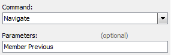
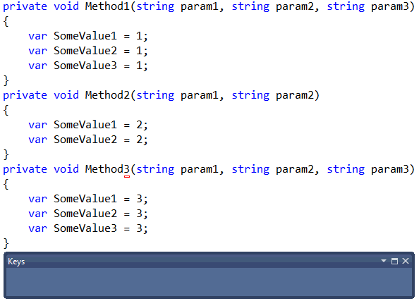
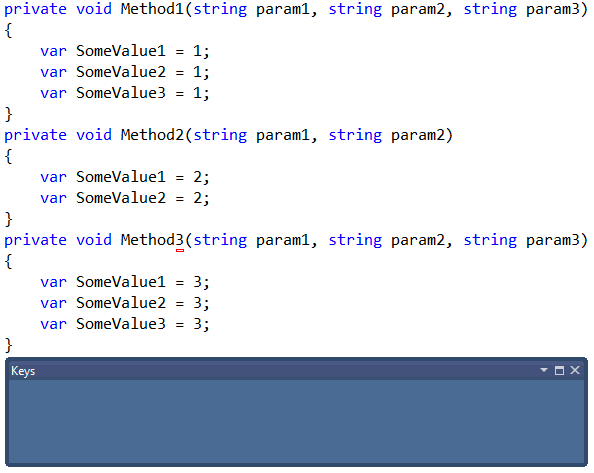

# 'Super Sibling Nav' for CodeRush #
Provides 2 additional Navigation providers which allow you to skip between sibling methods and properties whilst retaining relative selection and/or caret position

### Config ###
Simply [bind some shortcut keys](http://community.devexpress.com/blogs/rorybecker/archive/2010/10/05/binding-keys-in-coderush.aspx) to **Navigate(Member Next)** and **Navigate(Member Previous)** noting the contexts below.

(Note: The bits in brackets needs to go in the Parameters box.)

### Usage ###
Place your caret within a method or property and activate either **Navigate(Member next)** or **Navigate(Member)** as per your configuration.

See how when you select a method name and navigate away, the selection jumps to the next method name. Note: This will even work with methods of different length names.

See how the appropriate parameter is also maintained when moving from member to member. Note that this even adjusts for when the members don't have sufficient parameters.

See how this even works with statements.

Essentially Super Sibling Nav works to place you in a similar position to that which you started, only relative to the new sibling rather than the old one.
